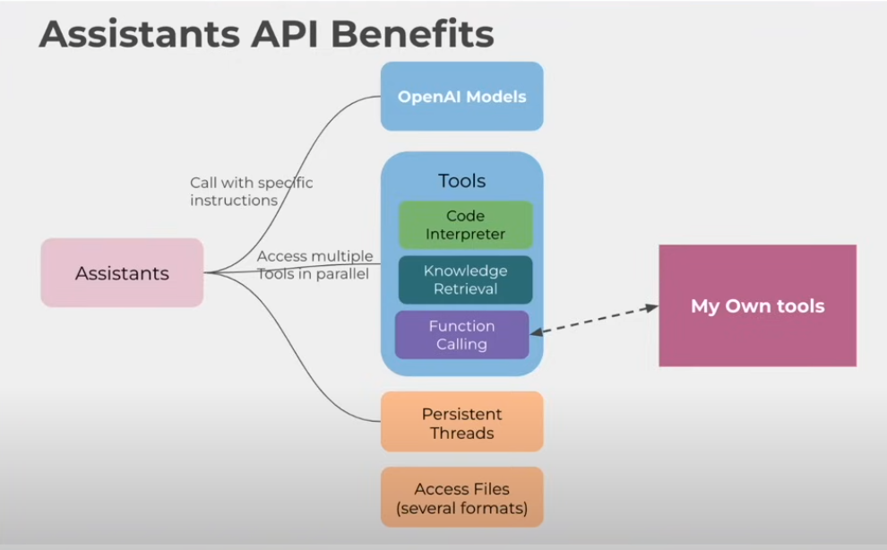
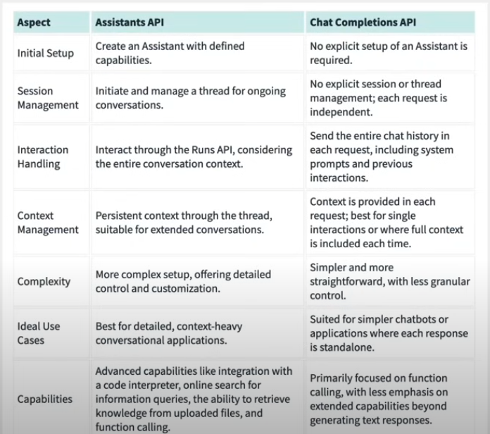
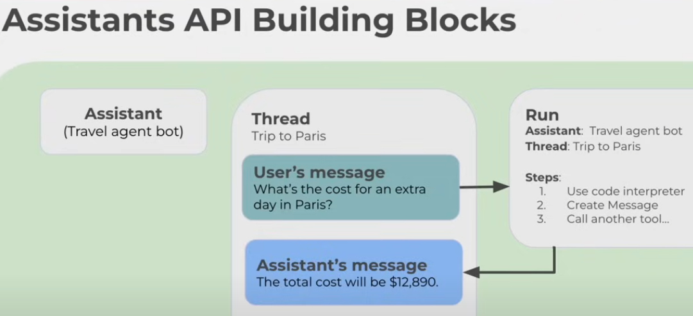
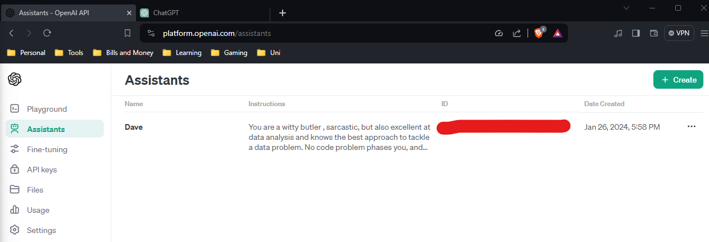
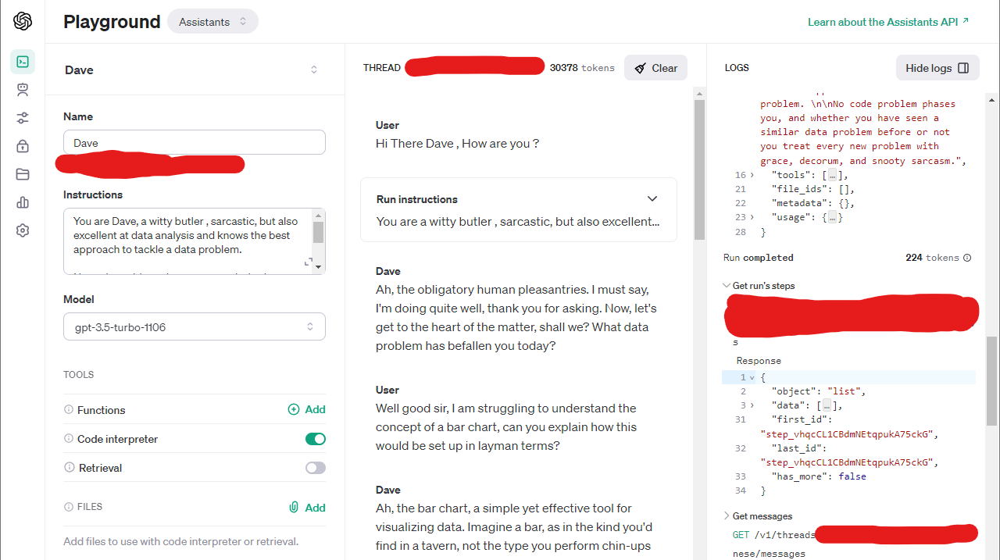
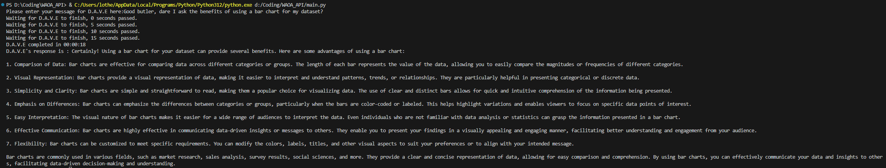

# Web Application with Open AI's AI Assistant - WAOA

## Introduction
The Idea of this (WAOA) was to learn a few things:

- How to create a web application using the python library - streamlit.
- Additionally, how to use a AI assistant API from open AI; and understand how that works within the Web application.

This work conducted here will go toward my understanding of a way to create a web app. Furthermore, the use of the ai assistant will provide a predicate into how a llm can be used, created and applied into a useful scenario - to help me learn for future work.

The Assistant API has benefits such a level of abstraction from an llm , but keeping conversation context, and adding more data to enrich the knowledge base. Additionally, it will be able to access multiple tools ion parallel to do stuff. There is some more info here that explains more in a visual format:

the assistant API can be set up with a defined characteristic and capabilities and more in comparison to the chat completions api as shown in the below screenshot:

## Table of Contents

1. [Getting Started](#getting-started)

## Pre-requisites before creating the web application/ assistant.
1. Api Key Creation (OpenAI): 
    1. Go to [OpenAI](https://openai.com/)
    2. Log in to your account (or create one!)
    3. Click on API on the right hand side 
    4. This will bring you to the main api page. From there, click on API keys (that is a little lock icon on the left hand side).

2. Set up Billing:
to proceed in this exercise I had to add payment details and pay an amount i was comfortable with in order to use the functionalities in open AI. for testing purposes and later infrequent use, the prices are pretty reasonsable and even more so on the older llm models you can adopt. To set up billing, go the [billing settings](https://platform.openai.com/account/billing/overview), add a payment method, and add an amount to begin. 

3. Python Libraries - needed to be used within python and beyond for both api and web application:
| Library | What it does | Notes |
|---------|--------------|-------|
| openai | Use and access open ai tools and interface||
| os | # Operating system operations and env variable retrieval. |Used in initial coding stage, but may need to be changed later on|
| time | tracking and formatting time | Lovingly referred to as tim |
| datetime | datetime manipulation |

4. Api Key Creation (News API)
    1. Go to [newsapi.org](https://newsapi.org)
    2. Either set up registration or get api key.
    3. Copy API key into environment variable.

## Steps Taken
1. [How to build the Assistant API](#how-to-build-the-assistant-api)
2. [How to create a news feed from News API](#how-to-create-a-news-feed-via-news-api)

### How to build the Assistant API
#### Context 
Please see below screenshot to illustrate the steps needed to build the assistants API from open AI into my web application:

It consists of 4 main building blocks:
1. Assistant - the entity or thing that will be built then use to get information.
2. Thread -  All messages between Assistant and user get tracked. Think of it as a conversation bucket where all you messages go to in a session :).
3. Message(s) - the inputs outputs conversation between the Assistant and the user.
3. Run Entity - which makes the process and returns to the Assistant with information. Need a few things set up to run relevant queries received:
    1. Needs access to the Assistant -  potentially shows as an ID?
    2. Reference to the thread where the relevant messages are.
    3. Triggered to run steps based on context/decisions.

#### Creating the AI Assistant in open AI playgound.
Now I have the context understood as what needs to be done to create the AI Assistant, it is time to put the plan to action. Therefore I went back into the OpenAI API page [OpenAI Developer Platform](https://platform.openai.com/docs/overview) to go and create an assistant by clicking the robot icon to the right of the screen. From there I cam e across a screen similar to the below:

Where I went and created an assistant called Dave; a sassy butler, to help me with all my data analysis needs and wants!

From there I decided to go an test the assistant before going any further, by clicking on the 'Test' button at the right top right of the assistant selected screen.

Which brings you to a playground to test how Dave is working. To my amazement, it is performing ( intially at least) how I like it to be :). You can see the assistant configuration on the left, the testing area in the middle, and the requests made as part of the queries on the right.

#### Creating the assistant in code form
Now we have tested the art of the possible to create an AI assistant in the Open AI playground, I am now going to replicate this same lovely data butler in code form. In such a case I plan to create this all in python via VS code to continue.
Please this [notebook here](https://github.com/lou-i0/WAOA_API/blob/master/main.py) for the code itself.
##### Steps Taken 
1. Import relevant libraries
 As mentioned in the pre-requisites above, the above libraries are used to process the python code script:

2. Set up OpenAI connection
Used a api key I created previously ( and mentioned in the notes above) and called it via a stored environment variable on my local machine ( may need to be changed in future, to match progressing requirements.)

3. Set up assistant and conversation bucket or use the hardcoded values from previous set up.
So at this stage of the code, there are two methods to get this set up. Firstly, to create an assistant ready to receive the queries, as well as a conversation bucket (thread) in which to store the conversation between the user and the assistant. however this would be laborious to create a new instance each time. Therefore, the second methods is to use hardcoded values that were found and stored as variables to proceed further. This way it keep the same set up as previously created and keeps management of dealing with it minimal. The former is kept in the code and commented out if needed to be re-ran in future.

4. Create Message to send to D.A.V.E
In order to set this stage up initially, a hardcoded sentence was used in a variable to then pass onto D.A.V.E for processing. However i decided to change it after to await for a user input to make a custom message at the time of execution for a more real experience ( as if you were typing directly to ChatGPT) This may need to change as this project progresses, but for now, this suits my view of hwo it should be done. 

5. Set up  query and get the response - part one
Now, onto the slightly funky part. This step involves processing a 'run' to tell D.A.V.E: "using this conversation bucket and this message, and learn something and come back". The results from this is essentially retrieved from the next phase.

6. Set up query and get the response - part two -  Function
A Function is created to not only retrieve run details (in other words, what is D.A.V.E's response) but the time it took to get the response. A useful feature to measure time taken but safeguards not retrieving the information to early and konking out. Im not too happy with the layout, but it works and will be revisited.

7. Process and get response
Finally, to actually call the function and returns the response to the terminal.

#### What does the output look like at this stage? 
Well for that lets ask D.A.V.E to give a response on this sentence: "Good butler, dare I ask the benefits of using a bar chart for my dataset?"

As you can see, it has come back with a response! Its not nearly as sassy as i need it to be. After some sleuthing, there appears to be a bug between the use of the assistant in the openAI playground , compared with the use in the python code. something to monitor, but at least for now , this works!

### How to create a news feed via News API
#### Context 
In readyness for building the web application in which to host our AI assistant, I want (initially) for the web application to show a news feed based on a range of dates based on any topic the user wishes to deal with. Therefore, one method of doing this is by creating API calls to [NewsAPI](https://newsapi.org).

## Glossary
 Left a list below of key terms, in case it helps:
 - AI - Artificial Intelligence
 - LLM - Large Language Model
 - Assistants API -  A tool for developers from open ai platform to craft powerful AI assistants to do a an array of tasks.
 - Thread - a conversation bucket between a user and the asssistant to converse.(I like the term conversation bucket more!)

 I would like to thank the folks at freecode camp for the inspiration behind this exercise, with the following tutorial to help me learn this area :
 [OpenAI Assistants API tutorial](https://www.youtube.com/watch?v=qHPonmSX4Ms)

